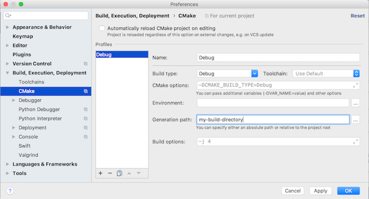

# GeoFeatures Development

## Building GeoFeatures for development

GeoFeatures uses `cmake` for an underlying build system in order to facilitate targeting multiple platforms and integration of various tools and tasks that need to be done while building.

Cmake makes it (relatively) easy for us to create a development environment we can count on.  We've made the system fairly easy to use.

> Note: cmake is **not** required to use GeoFeatures in other projects using the Swift Package Manager or CocoaPods.  It's only required if you want to contribute to the code-line of GeoFeatures.

### Getting started

We highly recommend '**out of source**' builds for working with GeoFeatures.

To create an out of source build, you can do the following.

```
# cd <root of geofeatures>
# mkdir .build && cd .build
# cmake ../
```
If all the dependent tools are installed, cmake will create the make files for development or any of the other tasks in this readme.

### Swift build & test

To build and test the code-line and run the appropriate tools, run the following commands.

> Make sure you are in the same directory you ran cmake originally.
```
# make
```
If you want to build the code-line only, run:
```
# make geofeartures-build
```
Or to specifically target the tests, run:
```
# make geofeartures-test
```

If you get stuck and need help, run:
```
# make help
```

### Jetbrains CLion

If you are using Clion, it will read the cmake files when you open the root of the GeoFeatures directory structure.

You should  reconfigure it after initial start up for '**out of source**' builds so you can keep the same cmake configuration in Clion as on the command line. To do that, open Clion preferences and set the "Generation path" to `.build` as shown in the screenshot below.




### Xcode

If you'd like to have an xcode project/workspace for your development efforts, we've built in a command to do that.

> Make sure you are in the same directory you ran cmake originally.
```
# make geofeatures-xcode-workspace
```

This will create a fully functioning Xcode project and workspace you can develop with. The workspace will include the Playground and the Project file so that you can build and use the playground.

> Note: We ignore the Xcode project and workspace files during git check-in (in the `.gitignore` file).
