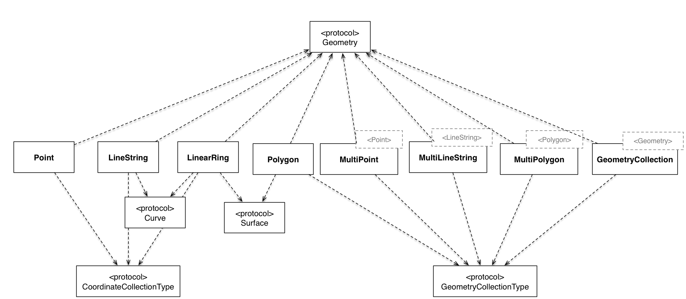

> **WARNING** This project is in a **_pre-release_** state. There is active work going on that will result in API changes that can/will break code while things are finished.  Use with caution.
>
>  For a stable release, please use the latest release of **GeoFeature 1** which can be found at [https://github.com/tonystone/geofeatures](https://github.com/tonystone/geofeatures). 

# GeoFeatures 

<a href="https://github.com/tonystone/geofeatures2/" target="_blank">
    
</a>
<a href="https://github.com/tonystone/geofeatures2/" target="_blank">
    
</a>
<a href="https://github.com/tonystone/geofeatures2/" target="_blank">
   
</a>
<a href="https://github.com/tonystone/geofeatures2/" target="_blank">
   
</a>
<a href="https://github.com/tonystone/geofeatures2/" target="_blank">
   
</a>
<a href="https://codecov.io/gh/tonystone/geofeatures2">
   
</a>

## Introduction

GeoFeatures is a lightweight, high performance geometry library for Swift.  It supports the full set of geometric primitives such as Point, Polygon, and LineString as well as collection classes such as MultiPoint, MultiPolygon,and MultiLineString.



## Features
- [x] Easy to use.
- [x] Point, MultiPoint, LineString, LinearRing, MultiLineString, Polygon, MultiPolygon, Box and GeometryCollection implementations.
- [x] [WKT (Well-Known-Text)](https://en.wikipedia.org/wiki/Well-known_text) input and output.
- [x] [GeoJSON](https://tools.ietf.org/html/rfc7946) input and output.
- [x] **Swift**: Written in pure Swift.
- [x] Open Sourced under the the [Apache License, Version 2.0](http://www.apache.org/licenses/LICENSE-2.0.html).

## Sources and Binaries

You can find the latest sources and binaries on [github](https://github.com/tonystone/geofeatures2).

## Installation (Swift Package Manager)

GeoFeatures  supports dependency management via Swift Package Manager on OSX and Linux.

Please see [Swift Package Manager](https://swift.org/package-manager/#conceptual-overview) for further information.

## Installation (CocoaPods)

GeoFeatures is available through [CocoaPods](http://cocoapods.org). To install
it, simply add the following line to your Podfile:

```ruby
pod "GeoFeatures"
```
See the ["Using CocoaPods"](https://guides.cocoapods.org/using/using-cocoapods.html) guide for more information.

## Communication and Contributions

- If you **found a bug**, _and can provide steps to reliably reproduce it_, [open an issue](https://github.com/tonystone/geofeatures2/issues).
- If you **have a feature request**, [open an issue](https://github.com/tonystone/geofeatures2/issues).
- If you **want to contribute**
   - Review  [Documentation/GeoFeatures-Development](Documentation/GeoFeatures-Development.md).
   - Fork it! [GeoFeatures repository](https://github.com/tonystone/geofeatures2)
   - Create your feature branch off of **master**: `git checkout -b my-new-feature`
   - Commit your changes: `git commit -am 'Add some feature'`
   - Push to the branch: `git push origin my-new-feature`
   - Submit a pull request :-)
   
> For instructions on how to build GeoFeatures for development, please see [Documentation/GeoFeatures-Development](Documentation/GeoFeatures-Development.md).


## Minimum Requirements

Build Environment

| Platform | Swift | Swift Build | Xcode |
|:--------:|:-----:|:----------:|:------:|
| Linux    | 5.0| &#x2714; | &#x2718; |
| OSX      | 5.0| &#x2714; | Xcode 11.3 |

Minimum Runtime Version

| iOS |  OS X | Linux |
|:---:|:-----:|:------------:|
| 8.0 | 10.10 | Ubuntu 14.04, 16.04, 16.10 |

> Note:
>
> To build and run on **Linux** we have a a preconfigure **Vagrant** file located at [https://github.com/tonystone/vagrant-swift](https://github.com/tonystone/vagrant-swift)
>
> See the [README](https://github.com/tonystone/vagrant-swift/blob/master/README.md) for instructions.
> 
   
## License

GeoFeatures is released under the [Apache License, Version 2.0](http://www.apache.org/licenses/LICENSE-2.0.html)
